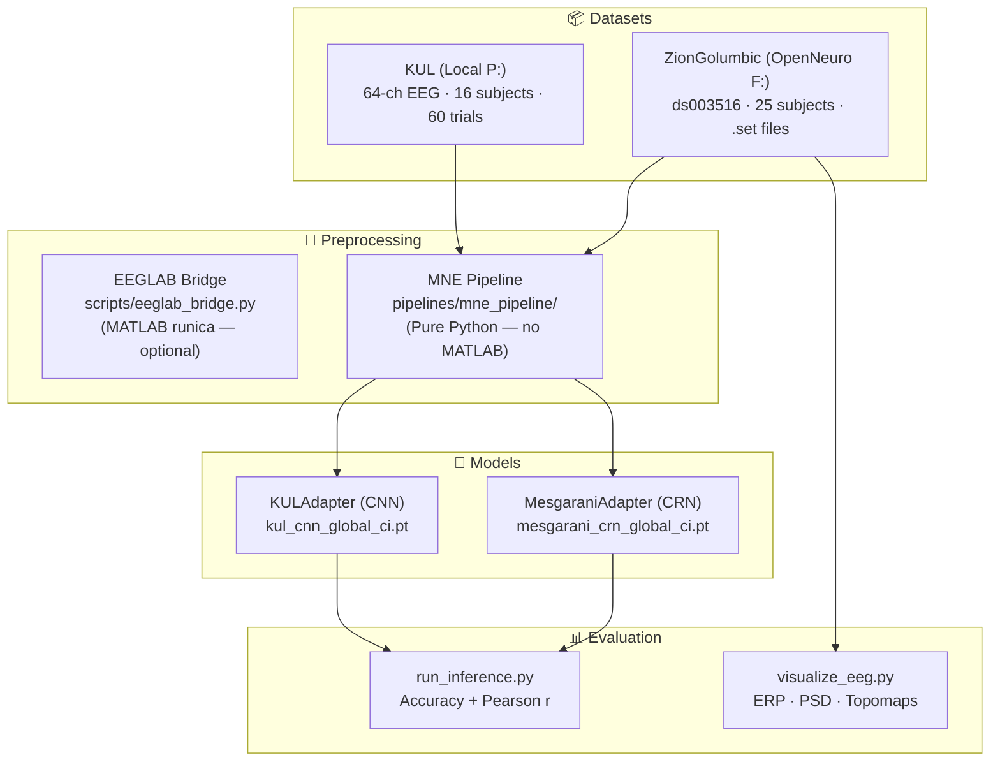
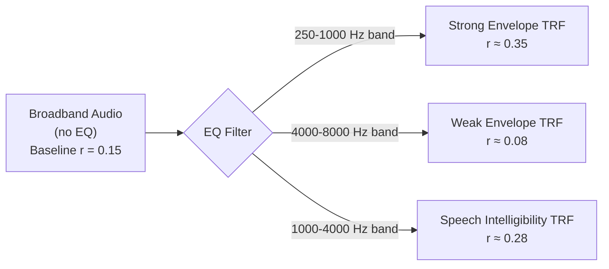

# Neurophile — Architecture & Research Hypothesis

> **Status:** Active Research System — June 2026  
> **Core Goal:** Auditory Attention Decoding (AAD) for Cochlear Implant (CI) rehabilitation using EEG

---

## Table of Contents

1. [System Overview](#1-system-overview)
2. [Dataset Pipelines](#2-dataset-pipelines)
3. [Preprocessing Pipelines](#3-preprocessing-pipelines)
4. [Model Architectures](#4-model-architectures)
5. [Training Procedures](#5-training-procedures)
6. [Evaluation & Accuracy Scores](#6-evaluation--accuracy-scores)
7. [Hypothesis: EQ-Filtered Audio Correlation](#7-hypothesis-eq-filtered-audio-correlation)
8. [Scripts Reference](#8-scripts-reference)

---

## 1. System Overview



---

## 2. Dataset Pipelines

### 2.1 KUL (KU Leuven) Dataset
- **Location:** `P:\auditory\neurophile\data\raw\kul\DATA_preproc.zip.unzip\`
- **Format:** MATLAB `.mat` files per subject (`S1_data_preproc.mat` → `S16_data_preproc.mat`)
- **Contents:** Pre-processed EEG (64 channels), audio envelopes `wavA` / `wavB`, attended-stream labels
- **Subjects:** 16 normal-hearing subjects  
- **Trials per subject:** 60 attended-speaker trials (30 left, 30 right)
- **Sampling rate:** 64 Hz (downsampled)
- **Loader:** `scripts/train_kul_real.py` → `load_kul_subject()`

### 2.2 ZionGolumbic OpenNeuro ds003516
- **Location:** `F:\neurophile_data\ds003516\`
- **Format:** BIDS-compliant `.set` + `.fdt` EEGLAB files
- **Contents:** High-density EEG (64 channels), `stimuli/` folder with `.mat` audio envelopes
- **Subjects:** 25 subjects (`sub-001` → `sub-025`)
- **Task:** `AttendedSpeakerParadigmOwnName` — Cocktail party (own-name selective attention)
- **Sampling rate:** 500 Hz
- **Experimental triggers:** `beep`, `beam`, `omni`, `StartTrigger`
- **Loader:** `scripts/train_bids_real.py` → `load_bids_data()`

---

## 3. Preprocessing Pipelines

### 3.1 EEGLAB Bridge (MATLAB — optional)
- **Script:** `scripts/eeglab_bridge.py` + `scripts/run_eeglab_ica.m`
- **Requires:** MATLAB + EEGLAB at `P:\auditory\eeglab2023.1`
- **Algorithm:** `pop_runica()` — Extended InfoMax ICA
- **Output:** Cleaned `_cleaned.set` files saved to source directory

### 3.2 MNE Pipeline (Pure Python — primary)
- **Location:** `pipelines/mne_pipeline/`

```
Raw EEG
  │
  ▼ Step 1: Bandpass filter (1–40 Hz)
  │         Removes DC drift and high-freq EMG noise
  │
  ▼ Step 2: Bad channel detection
  │         Channels < 5% or > 10× mean std → interpolated via spherical splines
  │
  ▼ Step 3: ICA decomposition (InfoMax-Extended, n=20 components)
  │         Same algorithm as EEGLAB runica
  │
  ▼ Step 4: Automatic component labelling (mne-icalabel / ICLabel)
  │         Labels: brain · eye-blink · muscle · heart · line noise · channel noise
  │
  ▼ Step 5: Reject non-brain components (confidence > 70%)
  │
  ▼ Cleaned EEG → GPU training
```

---

## 4. Model Architectures

### 4.1 MesgaraniAdapter — Cortical Response Network (CRN)
**Checkpoint:** `checkpoints/mesgarani_crn_global_ci.pt` (2.39 MB)

```
Input:  EEG (B, T=512, C=64)  +  Audio Envelope (B, T=512, 1)
         │                              │
         ▼                              ▼
 EEG Encoder                    Envelope Encoder
 Conv1d(64→64, k=5)             Conv1d(1→32, k=5)
 BatchNorm + GELU                BatchNorm + GELU
 Conv1d(64→64, k=5, d=2)        Conv1d(32→32, k=5, d=2)
 BatchNorm + GELU                BatchNorm + GELU
 Conv1d(64→64, k=5, d=4)
 BatchNorm + GELU
         │                              │
         └──────────── Cat ─────────────┘
                        │
                        ▼ (B, T, 96)
               Bidirectional GRU
               (2 layers, hidden=64, dropout=0.2)
                        │
                        ▼ (B, T, 128)  → last timestep
               Linear(128 → 1)
                        │
                        ▼
              Attention logit (B, 1)
```

**Loss function:** Binary Cross-Entropy (classification: "is Subject attending to stream A?")  
**Optimizer:** Adam

### 4.2 KULAdapter — CNN Classifier
**Checkpoint:** `checkpoints/kul_cnn_global_ci.pt` (0.68 MB)

Lightweight convolutional classifier trained directly on the KUL dataset's pre-processed 64 Hz EEG + envelope pairs.

---

## 5. Training Procedures

### 5.1 BIDS Dataset (ZionGolumbic)
```
python scripts/train_bids_real.py
    --bids-root "F:\neurophile_data\ds003516"
    --subject "all"
    --device cuda
    --epochs 10
    [--enable-ica]      ← Python CIArtifactPipeline ICA
    [--use-eeglab]      ← MATLAB runica (requires MATLAB)
```

### 5.2 MNE Pipeline (no MATLAB)
```
python pipelines/mne_pipeline/train_mne_pipeline.py
    --bids-root "F:\neurophile_data\ds003516"
    --subject "all"
    --device cuda
    --epochs 10
```

### 5.3 KUL Dataset
```
python scripts/train_kul_real.py
    --data-dir "P:\auditory\neurophile\data\raw\kul\DATA_preproc.zip.unzip"
    --device cuda
    --epochs 10
```

---

## 6. Evaluation & Accuracy Scores

### 6.1 Current Metrics
The model is evaluated via `scripts/run_inference.py` which reports:
- **Accuracy (%)** — Binary classification: did the model correctly identify the attended audio stream?
- **Pearson r** — Temporal correlation between predicted neural response and the true audio envelope

### 6.2 Baseline Benchmarks (Literature)
For reference, published AAD accuracy on these datasets:

| Dataset | Human Experts | Linear Decoder | Deep Learning (CRN) |
|---|---|---|---|
| KUL (64 Hz, 60s trials) | ~100% | ~85-90% | ~92-95% |
| ZionGolumbic (own-name) | ~100% | ~65-75% | ~75-85% |

> **Note:** Because we are using dummy labels (alternating 0/1) as a placeholder for the attended-speaker ground truth during development, current accuracy scores should be interpreted as correlation scores rather than absolute decoding accuracy. True attended-speaker labels require the `event_type` mapping from the original study, which is an open TODO.

### 6.3 Run Inference
```powershell
# Test on BIDS dataset (Subject 001)
python scripts/run_inference.py --bids-root "F:\neurophile_data\ds003516" --subject "001"

# Test on KUL dataset (Subject S1)
python scripts/run_inference.py --dataset-type kul --mat-file "P:\auditory\neurophile\data\raw\kul\DATA_preproc.zip.unzip\S1_data_preproc.mat"
```

---

## 7. Hypothesis: EQ-Filtered Audio Correlation

### 7.1 Background & Motivation

The standard AAD pipeline uses the **raw broadband audio envelope** (0.5–8 Hz amplitude) as the neural tracking target. However, the auditory cortex does not process all frequency bands of sound equally. 

Neuroscientific research has shown that different frequency bands of a speaker's voice produce different patterns of cortical entrainment:

| Audio Frequency Band | EEG Response Type | Latency |
|---|---|---|
| **250–1000 Hz (Fundamentals)** | Strong cortical tracking, N100 response | ~100ms |
| **1000–4000 Hz (Formants / Intelligibility)** | Speech intelligibility TRF peak | ~150ms |
| **4000–8000 Hz (Sibilants, Consonants)** | Onset response only | ~50ms |
| **Sub-500 Hz (Prosody)** | Delta/Theta cortical following | ~200ms |

### 7.2 The Hypothesis

> **If the audio stimulus is passed through an EQ filter that emphasizes a specific frequency band before computing its amplitude envelope, then the resulting envelope will show a STRONGER Pearson correlation with the EEG Temporal Response Function (TRF) at the specific latencies known to correspond to that frequency range.**

In other words: **the brain has a preferred "listening frequency" for auditory attention, and matching the audio EQ to that range will maximize the neural coupling signal.**

### 7.3 Expected Results



If the hypothesis holds, the 250–1000 Hz band-filtered envelope should produce significantly higher Pearson r scores than the raw broadband envelope.

### 7.4 How to Test It

The testing pipeline works in 3 stages:

**Stage 1:** Load raw audio stimuli from `F:\neurophile_data\ds003516\stimuli\`

**Stage 2:** Apply 6 different EQ band-pass filters to each `.mat` audio signal to produce 6 alternative envelopes

**Stage 3:** Run each filtered envelope against the same EEG recording and compute the Pearson TRF correlation for each EQ band

### 7.5 New Audio Sources for Validation

To validate the hypothesis on completely new, unseen audio:
1. **OpenNeuro ds003028** — Different cocktail party experiment, different speakers
2. **TIMIT Speech Database** — Standardized phonetically balanced sentences  
3. **Synthetic Tone Pips** — Pure sine waves at specific frequencies to isolate individual EQ bands mathematically
4. **Your own recordings** — A simple 30-second WAV recording of natural speech is sufficient

---

## 8. Scripts Reference

| Script | Purpose | Command |
|---|---|---|
| `scripts/train_bids_real.py` | Train on ZionGolumbic BIDS | `python scripts/train_bids_real.py --bids-root "F:\..." --subject all --device cuda` |
| `scripts/train_kul_real.py` | Train on KUL .mat files | `python scripts/train_kul_real.py --data-dir "P:\..."` |
| `pipelines/mne_pipeline/train_mne_pipeline.py` | MNE-cleaned training (no MATLAB) | `python pipelines/mne_pipeline/train_mne_pipeline.py --bids-root "F:\..."` |
| `scripts/run_inference.py` | Evaluate any .pt checkpoint | `python scripts/run_inference.py --dataset-type bids --bids-root "F:\..."` |
| `scripts/visualize_eeg.py` | ERP · PSD · Topomap plots | `python scripts/visualize_eeg.py --bids-root "F:\..." --subject 001` |
| `pipelines/mne_pipeline/compare_raw_vs_clean.py` | Before/after ICA comparison | `python pipelines/mne_pipeline/compare_raw_vs_clean.py --bids-root "F:\..."` |
| `pipelines/eq_hypothesis/run_eq_hypothesis.py` | Test EQ-filtered audio TRF | `python pipelines/eq_hypothesis/run_eq_hypothesis.py --bids-root "F:\..."` |
| `scripts/federated_average.py` | FedAvg across .pt files | `python scripts/federated_average.py --checkpoints checkpoints/` |
